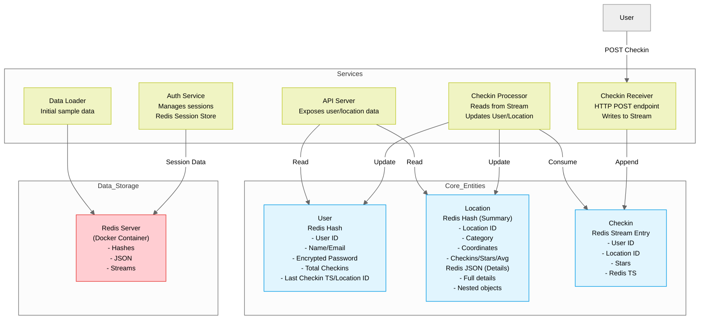

### Project Description

The project involves developing a social network application where users can "check in" at various locations and provide star ratings (0 to 5) based on their experiences. The application leverages Redis as both a data store and a cache to manage data efficiently. The core entities in the application are Users, Locations, and Checkins, each mapped to Redis data types for optimal storage and retrieval. The application will also include an API to interact with the data and support asynchronous processing for real-time updates.

### Key Features and Specifications

#### Core Entities and Data Storage

1. **Users**
   - Represented as a flat map of name/value pairs stored as Redis Hashes.
   - Data includes:
     - User ID
     - Basic information (e.g., name, email)
     - Encrypted password (using bcrypt)
     - Total number of checkins
     - Timestamp and location ID of the most recent checkin.

2. **Locations**
   - Maintains two types of data:
     1. **Summary Information**
        - Represented as a flat map of name/value pairs stored as Redis Hashes.
        - Data includes:
          - Location ID
          - Category (used for type-based searches)
          - Coordinates (longitude, latitude format)
          - Total checkins, total stars, and average star rating.
     2. **Location Details**
        - Represented as structured JSON documents with nested objects and arrays.
        - Utilizes Redis JSON support for retrieval and updates.

3. **Checkins**
   - Temporary storage for user checkins, represented as flat maps of name/value pairs.
   - Data includes:
     - User ID
     - Location ID
     - Star rating
     - Timestamp (automatically generated by Redis).
   - Stored in Redis Streams for asynchronous processing and time-stamped logging.

#### Application Architecture

1. **Services and Components**
   - **Authentication Service**
     - Handles user authentication.
     - Uses Redis as a shared session store accessible by other services.
   - **Checkin Receiver**
     - Receives checkins via HTTP POST requests from users.
     - Stores each checkin in a Redis Stream for further processing.
   - **Checkin Processor**
     - Monitors the Redis Stream for new checkins.
     - Updates user and location data (e.g., total checkins, last seen fields, average star ratings).
   - **API Server**
     - Provides API endpoints for interacting with user and location data stored in Redis.
   - **Data Loader Component**
     - Loads initial sample data into the system for testing and demonstration.

2. **Technology Stack**
   - **Backend:** Node.js with Express framework.
   - **Redis:** Used as the primary data store and cache.
   - **Redis Features:**
     - Redis Hashes for flat data structures.
     - Redis JSON for nested objects.
     - Redis Streams for checkin processing.
   - **ioredis:** Redis client for seamless integration.
   - **Docker:** Used to manage and deploy the Redis server.

3. **Processing Workflow**
   - Users post checkins via the Checkin Receiver.
   - Checkins are stored in a Redis Stream for time-stamped logging.
   - Checkin Processor retrieves and processes checkins from the stream.
     - Updates user and location data accordingly.
   - API Server provides endpoints to retrieve updated data.

### Development Steps

1. Clone the application repository.
2. Set up a Redis server using Docker.
3. Load sample data using the data loader component.
4. Implement and test each service:
   - Authentication Service
   - Checkin Receiver
   - Checkin Processor
   - API Server
5. Test end-to-end functionality:
   - User checkins
   - Data retrieval via API.

### Future Enhancements

- Implement geospatial search using Redis Search for location-based queries.
- Add more robust authentication mechanisms, such as OAuth2.
- Optimize the checkin processing pipeline for large-scale user activity.
- Enhance the API with additional filtering and sorting capabilities.

